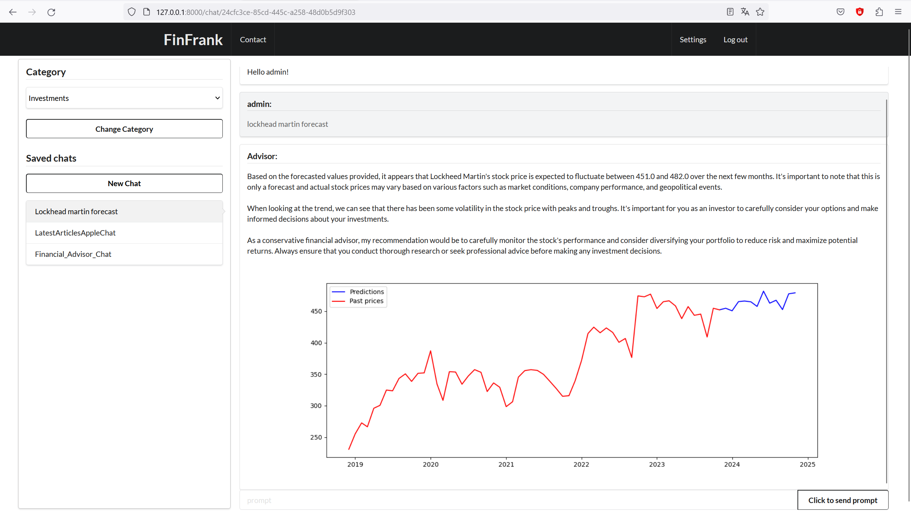
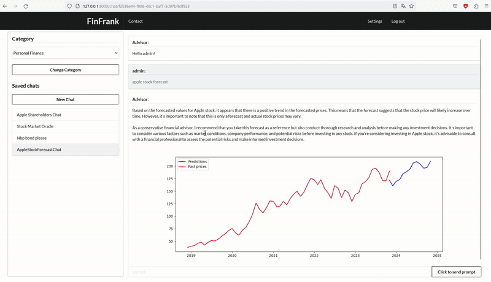

# FrankRank - Financial Advisory Chatbot
<p align="center">

</p>

## Problem

Finances often depend on subjective opinions, influenced by preconceptions or the potential dishonesty of financial advisors, leading individuals to be exposed to excessive risks due to poor advice.

## Solution

FrankRank is a Python-based web application that addresses this issue by utilizing a chatbot, specifically ChatGPT. Through prompt generation and function calling, the chatbot provides objective opinions on finances, eliminating biases and emotions associated with human decision-making.

## What did we implement?

- **Web Scraping:** The application performs web scraping to gather information from financial magazines.
- **Prompt Engineering:** OpenAI API is utilized for prompt engineering.
- **Web Development:** We created a website using the Django framework that stores customer data and acts as an interaction intermediary.
- **Stock Analysis Functions:**
    - Determine the company's trend on the stock exchange.
    - Format the latest news on the stock exchange.
    - Display companies' biggest shareholders.
- **Forecast Function:** We developed a function for a simple forecast of the company's price.

<p align="center">

</p>

## Technologies Used

- **Django:** A high-level Python web framework for building robust web applications.
- **OpenAI:** The OpenAI API is employed for fine-tuning ChatGPT and integrating it into the chatbot.
- **Azure Storage Blob:** The application utilizes Azure Storage Blob to store and manage data.
- **Semantic UI / HTML:** Semantic UI and HTML are used for frontend development, ensuring a user-friendly interface.
- **Data Warehousing:** We configured a Data Warehouse (DWH) on Azure SQL to store and manage customer data.

## Getting Started
```sh
pip install -r requirements.txt
python manage.py makemigrations
python manage.py migrate
python manage.py runserver
```
